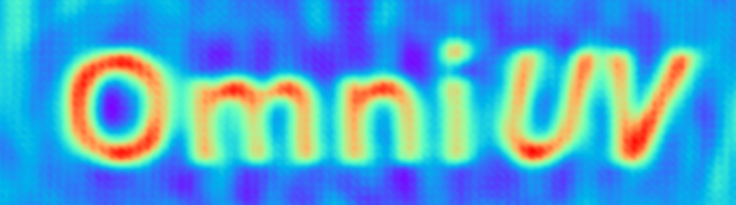
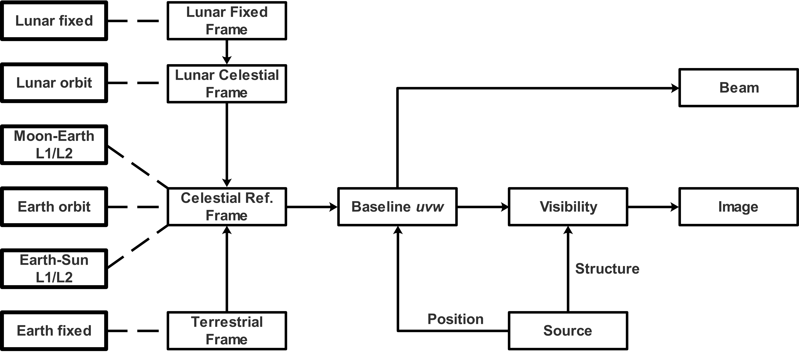
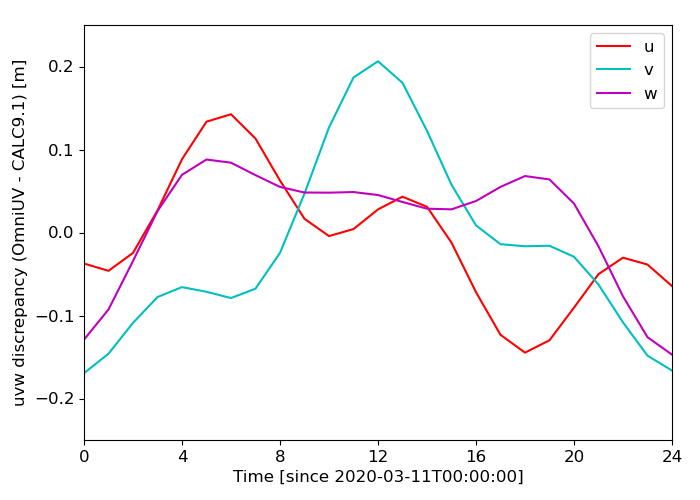
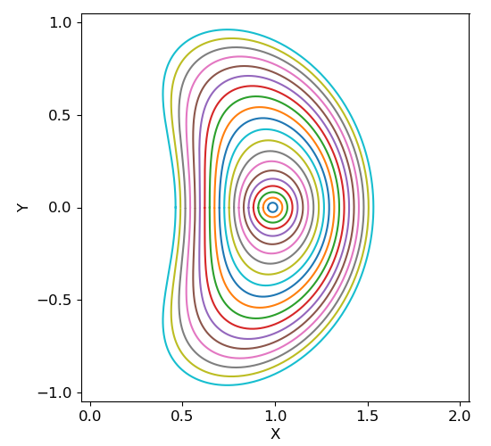
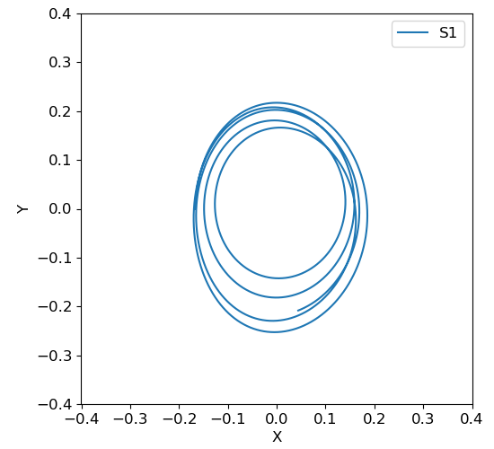

# Omni*UV*: An Omnipotent VLBI Simulation Toolkit

---

## **Introduction**

We develop Omni*UV*, so as to fulfill the requirement of simulation for both ground and space VLBI observations. 

**Note:**

1. The paper for this toolkit has been made available online:

-  `Lei Liu, Weimin Zheng, Jian Fu, Zhijun Xu, "OmniUV: A Multi-Purpose Simulation Toolkit for VLBI Observation", 2022, arXiv:2201.03797`

    We require that you cite the above reference and the repo link (`https://github.com/liulei/omniuv`) in your paper. 

2. The `cellsize` (in radian) and maximum `uv` range (in wavenumber) are of adjoint relation: `uv_max  =   1. / cellsize`. Therefore the corresponding `uv` range is `[-uv_max/2, uv_max/2]`. The toolkit will exclude `uv` samples outside this range. If the `cellsize` is too large, the corresponding `uv` range is very small. Possibility exists that all uv samples are excluded. 

    On the other hand, if the `cellsize` is too small, the coresponding `uv` range is very large. So does the uv grid size (`uv_max / ngrid`, here `ngrid` is the grid size in one dimension). It is possible that all samples concentrate in the very center part of the uv grid array.

    It is the responsibility of users to set appropriate `cellsize`. In general, the `cellsize` is a fraction of the angular resolution. Please refer to the code to figure out how the resolution is estimated (`run_example.py`, line 247 - 261). 

--- 

### **Functionality**
The main functionalities of the toolkit are:

- Trajectory calculation;
- Baseline *uv* calculation, by taking the availability of each station into account; 
- Visibility simulation for the given *uv* distribution, source structure and system noise;
- Image and beam reconstruction.

Omni*UV* supports two types of methods for visibility and imaging calculation (taking img -> vis for example):

- **FFT**: point sources are first assigned to the nearby grids in the image plane via certain kind of assignment function, then FFTed to the *uv* plane. Visibilities are reconstructed at given *uv* position via interpolation (assignment) function. 
    - Fast, therefore popular;
    - Suitable for small field;
    - *w* term cannot be taken into account;
    - Artifacts are introduced during gridding.
- **DFT**: Discrete Fourier Transform via Eq. (3) and (6) in the paper.
    - Computational expensive, therefore requiring GPU speedup;
    - Suitable for wide field;
    - *w* term is naturally supported;
    - No gridding artifact.

---

### **Source**
A Source in Omni*UV* actually refers to a **phase center**.

Omni*UV* supports _uvw_ calculations for multiple sources (phase centers). For each source, the input _ra_ and _dec_ are first converted to a unit vector in CRS: 

__s0__ = (_x_, _y_, _z_)

with:

_x_ = cos(_dec_) * cos(_ra_)

_y_ = cos(_dec_) * sin(_ra_)

_z_ = sin(_dec_)

The defination of the _uvw_ system follows that in the standard textbook (Thompson et al. 2001):

Given North Pole direction __n__ = (0, 0, 1) and source direction __s0__, __w__ is in the same direction as __s0__:

__w__ = __s0__,

 __u__ is the direction perpendicularto the plane defined by __n__ and __w__:

__u__ = __n__ x __w__,

__v__ is defined accordingly:

__v__ = __w__ x __u__.

---

### **Station**
Omni*UV* supports the following types of ground and space stations:

- Earth fixed (ground);
- Earth orbit;
- Moon fixed;
- Moon orbit;
- Earth-Sun Lagrange 1/2 points; 
- Earth-Moon Lagrange 1/2 points.

The trajectories of stations are first calculated in ther own coordinate system, and then tranformed to the **Celestial Reference System (CRS)**. 

The station _uvw_ is the projection of CRS position __p__ in the _uvw_ system defined above: 

(_u_, _v_, _w_) = (__u__, __v__, __w__) __·__ __p__.

The baseline _uvw_ is formed accordingly, by taking the station availability in each moment into account.

---

### **Image**
Visibility simulation requires an image as input. An image is binded to a source, and is described as a list of pixels (point sources). For each pixel, one has to provide the corresponding coordinate and flux. See `run_example.py` for a detailed example.

The _lmn_ of each pixel is the projection of the pixel position __s__ in the _uvw_ system defined above:

(_l_, _m_, _n_) = (__u__, __v__, __w__) __·__ __s__.

---

## **Prerequisites**

- Linux system
- Python 3
- gcc and make, for the compilation of `sofa` lib

---

## **Installation**

-   If you are in mainland China, please first run

    `sh pip_mirror.sh` 
  
    to select the pip host provided by aliyun.

-   Install dependences:

    `pip install -r requirements.txt`
 
-   The toolkit is provided as source code. Please import the package first:

    `from omniuv import *`
    
-   If your code and the pacakge are not in the same folder, you have to speficy the path that contains the package before importing the package. See `run_example.py` for an explanation.

-   To achieve the necessary precision for the trajectory calculation of earth fixed stations, `sofa` lib is needed. The source is provided in the `data/sofa` folder. To compile:

    `cd data/sofa`

    `make`

    This will generate `libsofa_c.so`. Note that both of EOP and sofa lib are optional for Omni*UV*. See **_uvw_ calculation** section for the corresponding loss of precision.

## **_uvw_ calculation**
- The trajectory calculation of Earth Fixed stations follows routines in VieVS. We have made elaborate comparisons of _uvw_ between Omni*UV* and CALC 9.1. The discrepancy is in the level of 20 cm:
  

- To achieve the necessary precision for _uvw_ calculation, Earth Orientation Parameters (EOPs) at specific dates are required. Below is the contribution of each EOP term to the trajectory precision:

    - tmu: 2 cm (for a typical value of 35 s)
    - dut1: 500m per 1s
    - Polar motion: 10 m (30 m per arcsec)
    - Precession and nutation: 10 km, requires both EOP and sofa

    It is the decision of uses to retrieve EOP and provide `libsofa_c.so` (see installation for details) for the necessary precision.

## **Example**
    
### `run_example.py`
- Due to the complexity of VLBI simulation, Omni*UV* is not intented and is not possible to be used as a black box. A comprehensive explanation for the usage of Omni*UV* is presented in this program. Please read it carefully.

### `tool.py` 
- Functions for plotting the uv, beam and image. Now the displayed unit is milliarcsec (mas), you may change them to other units by modifying the source code.

## **FITS-IDI output **

Omni*UV* supports exporting visibility and *uvw* data in `FITS-IDI` format, such that the simulation result could be imported to `AIPS` or `CASA` for further calibration and imaging. See the `to_fitisidi()` method in `run_example.py` for a demonstration.

Note that at present visibility records are not sorted in time order. This leads to a warning when importing data in `AIPS` using task `fitld`. To facilitate further data processing, the recommendated procedure for `AIPS` is: 

- `fitld`: load exported `fits-idi` file.
- `uvsrt`: set `sort` to `'TB'`, this setting is **very important** for further processing.
- `indxr`: generate index table `NX` and first `CL` table.

## **DRO (Distant Retrograde Orbit)**
Omni*UV* supports trajectory calculation for stations in Moon DRO. 
This is performed by integrating the equation of motion numerically in the Moon-Earth system. The initial conditions of DRO are taken from Tab. 4.1 of the Master thesis by Zimovan (2017). The 20 orbits are calculated accordingly:
  
Note that above calculations are performed in rotation frame by assuming the Moon orbit is perfect circle and are for demonstration only (by setting `do_dro_rot=True`). 

In reality, Moon orbit is elliptical. Calculation is performed in the Earth barycentric frame by retrieving Moon and Earth positions at given time from JPL ephemeris DE421. As a result, the trajectory is not even close, as demonstrated below.
 

### `dro/fig/`
Trajectories with different time steps and integration schemes are presented. Adjusting these parameters carefully.

### `dro/gen_dro_rot.py`
Demonstration of DRO in Omni*UV*. Note trajectories are presented in Moon-Earth rotation frame. By setting `do_dro_rot=True`, DROs are calculated in rotation frame directly and are for demonstration only. For actual calculation, set `do_dor_rot=False`. See comments in the program for detailed explanation.

## **Halo orbit**
One may obtain the L1 and L2 halo orbit by taking initial conditions in Tab. 4.3 and 4.4 of Zimovan (2017).

